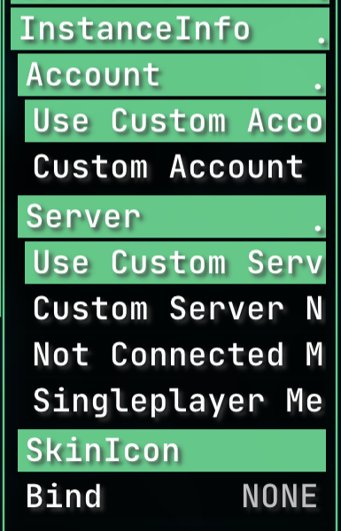

## rusherhack-instance-info

## Original Features

- **Account Name Display**: Display your current Minecraft account name in the window title.
- **Server Name Display**: Show the server you're connected to, including customizable messages for "Not Connected" and "Singleplayer" modes.
- **Skin Icon**: Displays your Minecraft skin as the window icon.

## What Was Added

This fork introduces:

1. **Custom Account Name**:
   - A setting to use a custom account name in the window title instead of the actual account name. The default is "Notch".
2. **Custom Server Name**:
   - A setting to use a custom server name in the window title instead of the actual server IP. The default is "oldfag.org".
3. **Custom Status Messages**:
   - Customize the messages displayed when not connected to a server or when in singleplayer mode.

## Screenshots

